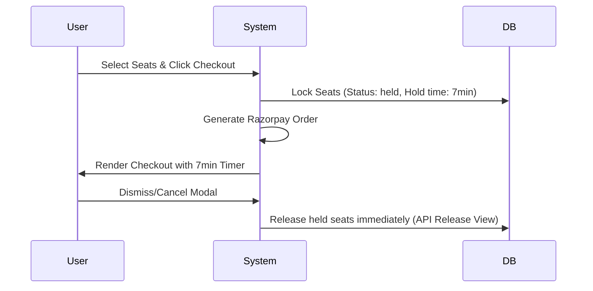

# Project Architecture & Codebase Structure

This document provides a comprehensive overview of the **Rameshwaram Cruise Varanasi** reservation platform architecture. It is designed to help any incoming developer quickly understand the directory tree, database models, configuration schemas, and core operational flows of the codebase.

---

## 📂 Directory Tree & Component Overview

```text
cruise_booking/
│
├── cruise_booking/                 # Core Django Configuration Folder
│   ├── settings.py                 # Main configuration, SMTP, holding limits & middleware settings
│   ├── urls.py                     # Main router importing apps url configurations
│   └── wsgi.py / asgi.py           # Server gateway bindings
│
├── accounts/                       # Staff Account Administration App
│   ├── forms.py                    # Login validations and custom fields
│   ├── models.py                   # User profile database abstraction models
│   ├── urls.py                     # Accounts path links
│   └── views.py                    # Staff login portal handler and rate limits
│
├── cruises/                        # Cruises & Vessel Details App
│   ├── models.py                   # Cruise (Vessels) and Ports models
│   ├── urls.py                     # Cruise routes
│   └── views.py                    # Home lander and schedule loading logic
│
├── bookings/                       # Booking Engine & Checkout Management
│   ├── models.py                   # Seat, Booking, BookingSeat, Schedule, and Payment models
│   ├── utils.py                    # Booking numbers, email triggers, and VAT/GST math calculations
│   ├── urls.py                     # Checkout, payment callbacks, and release API paths
│   └── views.py                    # CreateOrder, VerifyPayment, and ReleaseBooking endpoints
│
├── tickets/                        # Boarding Ticket PDFs & Scanning Gateways
│   ├── models.py                   # Ticket model & QR code generation script using `qrcode`
│   ├── urls.py                     # Download, render PDF, and QR scanner routes
│   └── views.py                    # VerifyQR scanner controller, PDF compiling, and GTK check fallback
│
├── otp_auth/                       # Customer Passwordless Email OTP Login
│   ├── models.py                   # EmailOTP code generator, timers, and verification models
│   ├── urls.py                     # Login/Verify/Logout endpoints
│   └── views.py                    # Send/verify OTPs, rate-limiting, and guess locking
│
├── dashboard/                      # Staff/Admin Dashboard Management Panel
│   ├── urls.py                     # Dashboard url routes
│   └── views.py                    # Bulk Schedule Builder, seat initialization, and CSV export views
│
├── templates/                      # Global HTML templates folder
│   ├── base.html                   # HTML base, layout styles, SEO blocks, and extra head blocks
│   ├── otp_auth/                   # OTP templates
│   ├── bookings/                   # Payment checkout, booking details, and email layouts
│   ├── dashboard/                  # Management index, bulk schedules dashboard, and booking logs
│   ├── tickets/                    # Live tickets view, scan verification layout, and print templates
│   └── cruises/                    # Homepage and landing templates
│
├── static/                         # Static Assets Directory
│   ├── css/                        # Custom page styles
│   ├── js/                         # Seat rendering grids and payment timers
│   └── images/                     # Official brand logos and graphic resources
│
├── media/                          # Dynamic Server-Generated Uploads (Git Ignored)
│   └── tickets/qr/                 # Generated boarding gate ticket QR codes
│
├── manage.py                       # Django CLI execution script
├── req.txt                         # Pip package dependencies list (Django, Razorpay, Weasyprint, etc.)
├── .env                            # Environment variables (DB, Mail, SMTP, Razorpay credentials)
├── deploy.txt                      # Step-by-step VPS hosting setup guide
└── structure.md                    # This developer guide file
```

---

## 💾 Core Database Schema & Relationships

### 1. `cruises` App
* **`Cruise`**: Defines vessel specs (e.g. vessel name, starting port, ending port).

### 2. `bookings` App
* **`Schedule`**: Binds a `Cruise` to a specific operational date, departure slot time, and capacity.
* **`Seat`**: Individual seats (labeling row R1 to R10, seat numbers, price status e.g. `available`, `held`, or `booked`). Has a foreign key linking to a `Schedule`.
* **`Booking`**: Holds booking records (guest profile details, booking date, amount, status: `pending`, `confirmed`, `cancelled`, or `expired`).
* **`BookingSeat`**: Connecting link linking a booked `Seat` to a `Booking` and binding passenger names.
* **`Payment`**: Connects a `Booking` to Razorpay IDs (`razorpay_order_id`, `razorpay_payment_id`, signature) and tracks payment states.

### 3. `tickets` App
* **`Ticket`**: Binds to a `Booking`. Generates a unique `ticket_number` and saves the dynamic boarding QR code image pointing to the booking number. Tracks boarding state (`is_used` & `used_at`).

### 4. `otp_auth` App
* **`EmailOTP`**: Generates a 6-digit random code, tracks its age (10-minute expiry), and counts failed authentication attempts.

---

## 🔑 Core Operational Flows

### 1. Booking & Seat Lock Flow


### 2. Payment Verification Flow
* User pays successfully via Razorpay interface.
* JavaScript POSTs order information to `/bookings/api/verify-payment/`.
* The server locks database seat entries using `select_for_update` (transaction concurrency lock).
* The Razorpay signature hash is verified using SHA-256 HMAC.
* Database states are updated: `Booking` status $\rightarrow$ `confirmed`, `Seat` status $\rightarrow$ `booked`.
* `Ticket` and QR code are built, and a confirmation email is dispatched.

### 3. Ticket Generation & PDF Engines fallback
* A custom checker checks for native Pango/Cairo GTK C libraries on Windows environments.
* If libraries are available, **WeasyPrint** is used to render high-quality PDFs.
* If libraries are missing, the system silently redirects rendering to the pure-Python **`xhtml2pdf`** fallback, preventing tracebacks.

---

## 🔒 Hardened Security Controls

1. **Brute-Force Limiters**: Strict 5 POST requests/min rate limiting on login/OTP challenges.
2. **OTP Attempts Lockout**: Automatically deletes/invalidates OTP credentials after 5 incorrect password inputs.
3. **Double-Boarding Block**: Scanning a ticket marks it used. A second scan rejects access.
4. **Environment Isolation**: Production settings default parameters are read from the environment variables file (`.env`).
